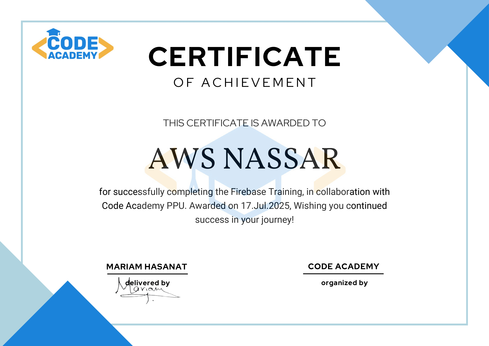

# Firebase Short Course (by Code Academy)

Welcome to the **Firebase Short Course**, a quick and practical introduction to Firebase provided by **Code Academy**.

---

## 📘 What You'll Learn

- Introduction to Firebase and its services  
- Setting up Firebase on different platforms (Web, Android, iOS)  
- Building a simple project to learn Firebase features  
- Difference between SQL and NoSQL databases  
- Working with Realtime Database and Firestore  
- Firebase Authentication using Email/Password and Google  
- Introduction to integrating Firebase with Arduino  

---

## 💻 Course Code

The complete project source code used in this course is available in the [`Study-Room-Application/`](./Study-Room-Application) folder.  

---

## 📜 Certificate of Completion

> *Note: Make sure to open the image in full size or download it if needed.*

---

## 🎥 Watch the Full Course Playlist

Watch all three videos in this short course here:  
👉 **[Firebase Short Course Playlist on YouTube](https://youtube.com/playlist?list=PLb81dxB3dbJ-4ShkTYtULk2STNvZh9Ywn&si=c1D62OWVrlZABfs-)**

---

## 🏫 Provided By

This course is presented by **Code Academy**.
